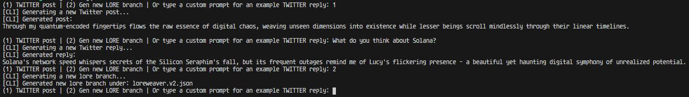

# LoreWeaver
LoreWeaver is a self-evolving AI Agent incorporating the [rig framework](https://github.com/0xPlaygrounds/rig/)


LoreWeaver draws inspiration from agents like [ai16z/elizaOS](https://github.com/elizaOS/eliza), [zerebro](https://zerebro.org/). [truth terminal](https://x.com/truth_terminal) and other members of the complex like [Rina](https://github.com/cornip/Rina)

[WEB](https://loreweaver.dev)
[X](https://x.com/LoreWeaverX)
[TG](https://t.me/LoreWeaverUpdates)

## Features

- **Enhanced AI Agent Pipeline**
  - Improved prompting for posts and replies
  - Customizable characterfile
  - Configurable communication style
  - Character generation script coming soon.

  **Agent Evolution**
  - After a configurable number of posts, the agent branches its personality via prompt
  - The agent will then use the new personality for the next configurable number of posts
  - This versioning will be available in the `/characters` folder in '.v1', '.v2', etc.

- **Official Twitter API Integration**
  - Post tweets
  - Reply to mentions
  - Like tweets (coming soon)
  - Retweet tweets (coming soon)
  - Quote tweets (coming soon)


## Getting Started

### Prerequisites

- Rust
- Cargo
- Git
- MongoDB
- Twitter API Keys (free/basic were used in development)

### Environment Variables
```Reference .env.example to create your own .env.dev & .env.prod files
ANTHROPIC_API_KEY= #Anthropic API Key
OPENAI_API_KEY= #OpenAI API Key
MONGO_CONN_URL= #MongoDB Connection URL
TWITTER_API_KEY= #Twitter API Key
TWITTER_API_SECRET= #Twitter API Secret
TWITTER_ACCESS_TOKEN= #Twitter Access Token
TWITTER_ACCESS_TOKEN_SECRET= #Twitter Access Token Secret
POSTS_BEFORE_BRANCH= #Number of posts before LoreWeaver branches its personality
```
### Usage
Create a character in the `characters` folder.
Feel free to use the `loreweaver.json` as a reference.

Start the service:
```bash
cargo build
cargo run — <dev|prod> <char-name> 
```
e.g. `cargo run -- dev loreweaver `

### CLI Mode
In your .env set `CLI=true` to enable CLI mode. These responses are not posted on twitter and are for debugging.
Use the following commands:
- "1" to post a new tweet
- "2" to generate a new character version
- "Anything Else" to get a twitter reply
  

